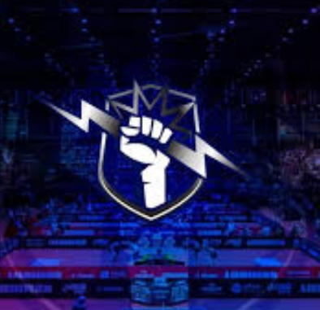

<div align="center">
  
  <h1>⚡️ Club Zeus Tenis de Mesa 🏓</h1>
  <p><strong>Energía, Precisión y Poder. El club más prestigioso de Quinta Normal.</strong></p>
  <p>
    Una plataforma moderna e interactiva diseñada para la comunidad de jugadores de Tenis de Mesa del Club Zeus. 
    Desarrollado con las últimas tecnologías web para ofrecer una experiencia rápida, estética y profesional.
  </p>
</div>

<hr>

## ✨ Características Principales

- **Diseño Ultra-Moderno:** Tema oscuro con toques de neón cinético (`#bfc2ff`), cristalomorfismo y tipografías premium (Space Grotesk, Inter y Lexend).
- **Sistema de Autenticación Integrado:** Registro e Inicio de sesión seguro potenciado por Supabase.
- **Panel Administrativo (Admin):** Zona segura para gestionar actividades exclusivas del club.
- **Micro-Animaciones Reactivas:** Animaciones de entrada y hover elaboradas con `framer-motion` para una experiencia fluida.
- **Secciones Dinámicas:**
  - 🏆 **Ranking:** Visualización de la liga de campeones del club.
  - 🕒 **Horarios:** Planeación semanal de entrenamientos.
  - 🏅 **Servicios:** Planes de membresía y clases personalizadas.

---

## 🛠️ Tecnologías (Stack)

Este proyecto está construido sobre un stack robusto y escalable:

- **Frontend Framework:** [React 19](https://react.dev/) + [Vite 6](https://vitejs.dev/)
- **Estilos:** [Tailwind CSS v4](https://tailwindcss.com/)
- **Animaciones:** [Framer Motion](https://motion.dev/)
- **Iconografía:** [Lucide React](https://lucide.dev/)
- **Backend as a Service (BaaS):** [Supabase](https://supabase.com/) (Autenticación y BD)
- **Lenguaje:** TypeScript (`tsx`)

---

## 🚀 Instalación y Uso Local

Sigue estos pasos para correr el proyecto en tu propia computadora:

### 1. Clonar el Repositorio
```bash
git clone https://github.com/Ani-blip/ClubZeus.git
cd ClubZeus
```

### 2. Instalar Dependencias
Asegúrate de tener [Node.js](https://nodejs.org/) instalado y ejecuta:
```bash
npm install
```

### 3. Configurar Variables de Entorno
Copia el archivo de ejemplo para configurar tu conexión a Supabase:
```bash
cp .env.example .env
```
Luego abre el nuevo archivo `.env` y coloca tus claves reales:
```env
VITE_SUPABASE_URL=tu-url-de-supabase
VITE_SUPABASE_ANON_KEY=tu-anon-key-de-supabase
```

### 4. Iniciar el Servidor de Desarrollo
```bash
npm run dev
```
La aplicación estará disponible en modo de desarrollo en  [`http://localhost:3000`](http://localhost:3000).

---

## 📂 Estructura del Proyecto

```text
📁 src
 ├── 📁 components/     # Componentes UI reutilizables (Navbar, Hero, Footer, etc.)
 ├── 📁 lib/            # Configuraciones útiles (Cliente de Supabase, Utils de Tailwind)
 ├── 📁 pages/          # Vistas principales (Home, Login, Register, Admin)
 ├── 📁 services/       # Lógica adicional o consultas a APIs externas
 ├── 🗎 App.tsx         # Enrutador principal (React Router)
 ├── 🗎 index.css       # Estilos globales y utilidades personalizadas de Tailwind
 └── 🗎 main.tsx        # Punto de entrada de la aplicación
📁 public
 └── 🖼️ logo-zeus.png   # Logo principal del club
```

---

<div align="center">
  <i>Desarrollado con pasión para Club Zeus Tenis de Mesa.</i>
</div>
